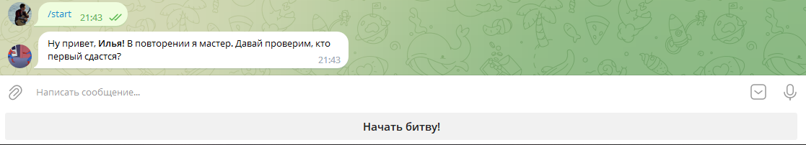
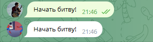
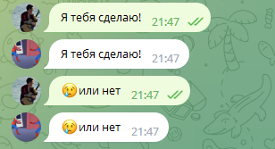

# Тестовое задание
## Простой эхо бот 
>При запуске /start, выходит приветствие, а так же появляется кнопка "Начать битву!":

>При нажатии на кнопку, текст кнопки отправляется в чат, бот тут же повторяет фразу:

>Дальше бот повторяет весь текст, который ты ему отправишь:

